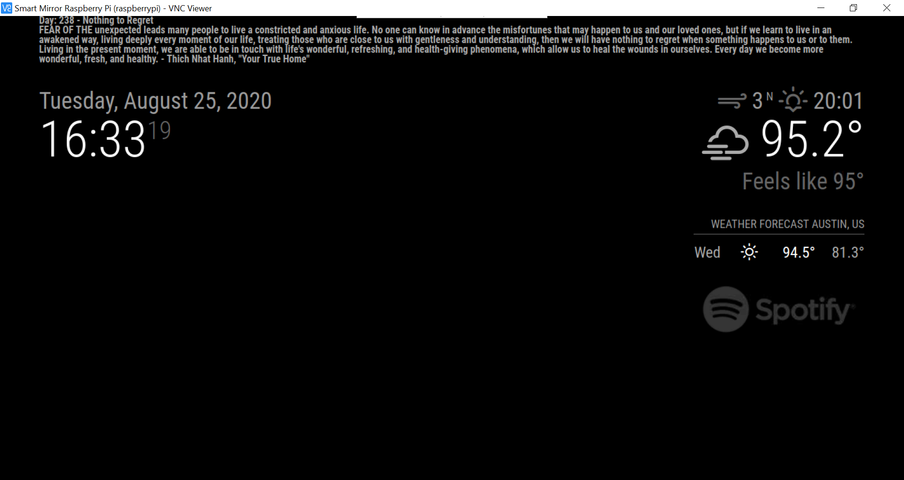
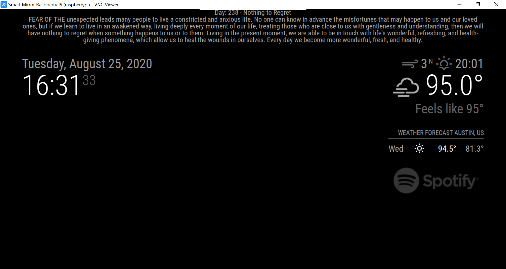

# MMM-DailyBuddhismWisdom
A module for the [Magic Mirror](https://github.com/MichMich/MagicMirror) project by [Michael Teeuw](https://github.com/MichMich) that displays a daily bit of Buddhist wisdom from Thich Nhat Hanh's Your True Home based on the current day of the year.

## Screenshot
| | |
|---|---|
|Screenshot on August 25th 2020, the 238th day of the year with default config.|Screenshot on August 25th 2020, the 238th day of the year with example config.|

## Preconditions
* MagicMirror<sup>2</sup> instance
* Node.js version >= 7
* npm

## Installing

In your MagicMirror directory: 

```bash
cd modules
git clone https://github.com/anthpham/MMM-DailyBuddhismWisdom.git
cd MMM-DailyBuddhismWisdom
npm install
```

## Updating

Go to the module’s folder inside MagicMirror modules folder and pull the latest version from GitHub and install:

```bash
git pull
npm install
```

## Configuring
There is not very much to configure but here are the options:

| Option | Description |
|--------|-------------|
| `show_page` | <p>A boolean value that determines whether this module's text should be displayed or not.</p><p>**Type:** `boolean` **OPTIONAL**<br>**Example:** `false`<br>**Default Value:** `true`</p> |
| `font_size` | <p>A string that determines the size of the font.</p><p>**Type:** `string` **OPTIONAL**<br>**Example:** `"medium"`<br>**Default Value:** `"small"`<br>**Options:** `"xx-small"` `"x-small"` `"small"` `"medium"` `"large"` `"x-large"` `"xx-large"` </p> |
| `font_weight` | <p>A string that determines the weight of the font.</p><p>**Type:** `string` **OPTIONAL**<br>**Example:** `"lighter"`<br>**Default Value:** `"bold"`<br>**OPTIONS:** `"lighter"` `"normal"` `"bold"` `"bolder"` <br> Light to bold: `"100"` `"200"` `"300"` `"400" (normal)` `"500"` `"600"` `"700" (bold)` `"800"` `"900"` </p> |
| `text_align` | <p>A string that determines the alignment of the text.</p><p>**Type:** `string` **OPTIONAL**<br>**Example:** `"center"`<br>**Default Value:** `"left"`<br>**OPTIONS:** `"left"` `"right"` `"center"` `"justify"`</p> |
| `line_height` | <p>A string that determines the distance between lines in the text.</p><p>**Type:** `string` **OPTIONAL**<br>**Example:** `"normal"`<br>**Default Value:** `"1"`<br>**OPTIONS:** `"normal"` <br> `"*number*"` A number that will be multiplied with the current font size to set the line height</p> |
| `show_author_book` | <p>A boolean value that determines whether the author and book's title shoudl be displayed at the end of the quote.</p><p>**Type:** `boolean` **OPTIONAL**<br>**Example:** `false`<br>**Default Value:** `true`</p> |

Here is an example for an entry in `config.js`

```javascript
{
    module: "MMM-DailyBuddhismWisdom",
    position: "top_bar",

    config: {
        font_size: "medium",
        font_weight: "500",
        text_align: "center",
        show_author_book: false
    }
}
```


## Special Thanks

* [Michael Teeuw](https://github.com/MichMich) for inspiring me and many others to build a MagicMirror module.
* [Sam Detweiler](https://github.com/sdetweil) for finding and fixing errors in this module.


## Contributing

If you find any problems, bugs or have questions, please [open a GitHub issue](https://github.com/raywo/MMM-NowPlayingOnSpotify/issues) in this repository.
